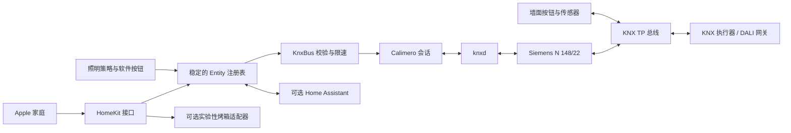

# bunniesHCB 架构、需求与实现审查

审查日期：2026-09-14。代码基线：`3eef80e`，另将审查开始时未提交的厨房照明改动原样保存在 `2730a3b`。改动位于 `codex/knx-safety-architecture`，不覆盖原工作目录。

这套系统已有合适的基础：KNX 承担设备与墙控通信，HCB 提供 HomeKit 桥接和软件逻辑，Adapter / Entity / Policy 的分层也值得保留。本次同时新增统一家庭模式与房间级手动优先规则，详情见 [模式设计与行为](house-modes.md)。原实现的主要问题集中在重连时对象和任务的生命周期、把控制意图当作真实状态、缺少故障测试及可审阅的上线流程。此次改动沿用原有实体和组地址，不重新设计全屋接线或批量改写 ETS。

**审查没有发现近期生产故障的证据，也没有证明整个系统已完成现场验收。** 代码中可触发的缺陷、ETS 静态配置风险和实际运行证据在下文分别标明。

## 1. 方法与证据边界

| 证据 | 已完成工作 | 可以说明什么 / 不能说明什么 |
| --- | --- | --- |
| 本地源码与 Git | 审阅入口、KNX/HA/Broadlink、HomeKit、全部照明策略和配置；保留原提交及未提交改动 | 能定位实现问题；不能据此推定某个问题已经在家中发生 |
| 生产服务，只读 | 读取运行时、服务状态、依赖清单及近 7 天日志；制作应用和配对文件私有备份 | 原进程自 8 月 19 日运行，审查时约 26 天，`NRestarts=0`；该日志窗口未发现重连或异常记录 |
| knxd，只读 | 检查服务与转发配置；做约 50 秒 group socket 订阅 | 证实中间存在 knxd，收到 48 条报文记录，包括在线状态报文；该文本没有接收时间戳，不能据此声称精确测出了 15 秒周期 |
| ETS，离线 | 解析项目 XML、应用通信对象及引用的继承标志，生成代码绑定契约并对照 | 19 个设备、376 个组地址；已关联对象均能解析。项目文件不能证明设备当前下载内容和实际接线 |
| 上游一手资料 | Siemens 技术资料、Calimero 对应版本源码、KNX 项目格式、HA WebSocket 文档、依赖发行记录 | 核对协议/API 约束；不同年代 Siemens 文档有差异，不能代替读取现场固件版本 |
| 候选版本测试 | 假 KNX、假 WebSocket、虚拟时间、临时配对身份、嵌入式 HTTP 通道 | 验证故障与边界行为；不等价于真实灯具、窗帘、DALI 或 Apple 设备验收 |

详细 ETS 导出、原始运行日志、生产 unit、地址拓扑和含密钥的备份保存在仓库外的私有审查目录。公开仓库只保留审查结论、工具、合成测试数据和通用部署示例。

## 2. 需求及保留的设计意图

| 需求 | 来源 | 本次落实 |
| --- | --- | --- |
| 保留 DIY 原版，所有改动走新分支和 PR | 用户明确要求 | 原目录不改；Git bundle、工作区补丁、未跟踪文件和生产包另行备份；Conventional Commits |
| 尽量依靠有线 KNX，已有 DALI 和墙面按钮 | 用户明确说明 | 保留 KNX/DALI 与原组地址，不增加必需云服务 |
| 部分传感器每 15 秒发送在线报文；任意报文即说明没有接收静默问题 | 用户两次澄清 | **任意收到的 process telegram 刷新存活时间，默认 45 秒静默重连**；不建立按传感器或特定组地址筛选的心跳规则 |
| HomeKit 配对和现有实体身份继续可用 | 从现有使用方式推导的兼容性要求 | 实体对象跨重连保留；原命名和 ID 算法不变；原 AuthState 格式可读；损坏文件报错而不生成新身份覆盖 |
| 故障不能导致积压命令恢复后突然执行 | 安全优化所需的保守约束 | 断线拒绝命令；发送队列有时限；事件、读结果和恢复定时器绑定连接代次 |
| 手动控制优先，未知状态不应凭空触发场景或加热 | 保守实现选择，待使用体验验收 | 命令与反馈分开；真实控制显式启用；可选烤箱默认关闭；水槽自动化只关闭自己点亮的灯 |
| 保留原照明参数和使用习惯 | 从已有代码推导 | 保留 200 lx 目标、占用延时、原自适应色温曲线及场景编号；修正边界错误而不重新“设计生活习惯” |

“任意报文”是接收通路存活判断，不是每个设备的健康诊断。knxd 缓存、IP 侧其他流量和软件回显可能使通路有报文，但这不能单独证明某个执行器或 TP 段正常。本次遵循用户原意保留该策略；这项可观测性边界不构成将策略改为逐设备检测的理由。

## 3. 现场架构与软件边界

实际应用的连接经过 knxd，而不是由每个软件客户端直接占用 Siemens 的隧道连接。ETS 配置中的接入路径也经过该中间层。

直接关联执行器对象的 KNX 墙控可独立于 HCB 工作。软件场景协调、延时关灯、全屋夜间模式、HA 电视/扫地机按钮等则依赖 HCB；不能笼统地承诺“停掉 homelab 后所有按钮仍保持全部功能”。现场验收必须区分这两类功能。

Siemens 2014 年技术说明给出最多 5 个 KNXnet/IP tunneling 连接，要求连接使用不同的 KNX 个体地址。较早文档存在 4 个连接的表述，应结合实际版本解释。现场使用 knxd 的客户端地址池，不应在未核对地址规划时绕过 knxd 新开多个直接连接。此次未修改 knxd、Siemens 参数或 ETS 下载内容。[Siemens N 148/22 技术说明](https://knx-td.sihub.siemens.com/de/tpi/1481ab22_tpi_de_2014-07-03.pdf)、[较早安装说明](https://cache.industry.siemens.com/dl/files/605/48309605/att_112476/v1/1481ab22_bma_d-e_2009-07-20.pdf)、[knxd 配置文档](https://github.com/knxd/knxd/blob/main/doc/inifile.rst)。

## 4. 实现问题与修正

### 4.1 连接生命周期

原 `KNXAdapter.start()` 同时创建隧道、注册实体、启动策略、启动时钟并读取设备状态；重连通过 `stop()` / `start()` 重做这些工作。策略在配置注册时直接启动，但没有完整的注销机制。实体注册表重建后，HomeKit 和旧订阅还可能持有先前对象。首次连接失败、启动过程中收报及最终关闭后迟到的重连回调也缺少一致处理。

新版将流程拆为：`configure()` 只建目录和绑定；连接成功后在 `SYNCHRONIZING` 状态进行读取；进入 `CONNECTED` 后启动允许的服务。重连只替换 `KnxConnection`，实体对象、HomeKit ID 和服务实例不更换。初次失败也会重试，退避从 1 秒增长到最多 60 秒，最终关闭会停止重连、事件线程和定时任务。

接收回调首先刷新存活时间，再把事件交给有界队列。协议回调不执行应用场景或阻塞的组写；应用事件单独串行分发，避免实体锁内同步调用订阅者造成交叉等待。两个队列容量均为 512，溢出会触发重连和状态失效，不继续相信不完整缓存。Calimero 的对应版本实现确实同步调用 process listener，因此这一区分有直接源码依据。[Calimero ProcessCommunicatorImpl 3.0-M1](https://raw.githubusercontent.com/calimero-project/calimero-core/v3.0-M1/src/io/calimero/process/ProcessCommunicatorImpl.java)。

45 秒检测保留原意，改用单调时钟计时，检查周期 5 秒；触发通常发生在静默 45–50 秒之间。初始化读状态阶段不触发静默判定，完成同步后给予完整窗口。它与 KNXnet/IP 的连接状态检查职责不同。[Calimero ClientConnection 3.0-M1](https://raw.githubusercontent.com/calimero-project/calimero-core/v3.0-M1/src/io/calimero/knxnetip/ClientConnection.java)。

### 4.2 命令、状态和发送约束

原实现部分 setter 乐观地修改实际状态，亮度/色温还会在写入后一段时间忽略反馈。这样既可能显示未执行成功的状态，也可能吞掉墙面操作。窗帘超时也不应被当成“已经到达目标位置”。

新版灯具的电源、亮度、色温和窗帘当前位置以状态地址反馈为准。启动读不到或重连后未重新获得的值标为未知，HomeKit getter 返回失败的 future。窗帘运动超时使位置失效，不伪造到位；色温为零时不会做除零换算。软件 Toggle 是例外：它由软件管理，组写成功后更新本地状态，但不把它描述成执行器反馈。

`KnxBus` 是应用唯一的组读写出口：真实模式校验、声明过的写地址与类型校验、每次发送后至少 100 ms 间隔、最多 2 秒等待发送资格、每次读默认 2 秒响应超时。连接变化后丢弃旧请求和旧读结果，不重放。场景仅允许 0–63 的 recall，不允许 store/reserved 位。输入范围不合法会在发送前失败。隧道发送成功仍不等于执行器已经完成动作，因此状态确认继续依赖反馈。

对只在数值改变时报告的传感器，本次没有添加任意“数据 30 秒没变就失效”的 TTL。状态有效性以当前连接代次为边界；如果需要逐传感器新鲜度，需要先核对每个对象的周期发送参数。

### 4.3 照明策略、场景及软件按钮

| 项目 | 修正后行为 | 验收重点 |
| --- | --- | --- |
| 恒照度 | 已知占用与照度才控制；启动时不因默认值误开；保留原目标、死区、步进、保持和待机逻辑 | 两卧室实际调光稳定性、反馈延迟、照度传感器位置与校准 |
| 自适应色温 | 保留 2702–6535 K 曲线；连接代次变化后重新确认发送；限制重复写入 | 清晨/夜间色温体验及 DALI 可用范围 |
| 夜间照明 | 关闭事件可以重置状态；5 点锁定后的 9 点退出仍能执行；重连不解除已进入的晨间锁定 | 时区、晨间边界、夜间移动及手动开关体验 |
| 浴室 | 夜间模式优先，普通占用自动场景避免覆盖夜间场景 | 两种模式切换、离开浴室后的关灯 |
| 场景暂停 | 多次场景重设 8 小时恢复计时；手动设置包括重复 OFF 都取消恢复；旧连接的恢复任务不跨连接执行 | 手动关自动化后是否一直保持关闭 |
| 厨房水槽 | 保留用户未提交的逻辑；自动化只回收自己点亮的水槽灯 | 用户先手动打开水槽灯后，离开厨房不应被策略关闭 |
| 按钮/场景事件 | 读响应不触发动作；场景存储 telegram 不被当作 recall | 墙控实际编码、按下/释放、长按与场景反馈 |
| 全屋夜间/延时关灯 | 开关覆盖全部配置房间；重复延时按钮替换旧定时器，关闭时清理 | 延时边界及不同房间场景效果 |
| 扫地机器人按钮 | ETS 为 DPT 3.007；解析 step/control nibble，忽略 stop/release，再检查 HA 已知状态 | 现场按键一次只启动一次，释放报文不再启动 |

夜间时段、8 小时恢复和恒照度目标来自现有代码，不代表新的用户需求已经得到确认。跨进程重启的手动覆盖期限尚未持久化；当前实现选择不恢复旧进程的延时命令。若日后需要跨重启延续覆盖，应记录带截止时间的用户策略状态，而不是持久化待执行硬件命令。

### 4.4 HomeKit、Home Assistant 与烤箱

HomeKit：保持原实体 ID 算法，增加碰撞检查；配置名称共享一个存储实例；配对/名称文件采用私有临时文件加原子替换。反序列化有允许类型和大小限制，损坏身份不会被静默覆盖；密钥数组不再通过 getter 暴露可写引用。加载生产备份的离线检查确认原配对文件字节未改变。尚未用真实 Apple 客户端测试新网络依赖和服务发现。

Home Assistant：认证完成后才发送命令；请求 ID、结果失败和超时有对应 future；断线使状态失效并失败结束在途命令。启动订阅和快照缺一不可，较旧快照不会覆盖已收到的实时事件。可选 HA 失败不结束 KNX；令牌可以从环境或文件读取。WebSocket 的认证与 `subscribe_events` / `get_states` / `result` 处理根据官方协议核对。[Home Assistant WebSocket API](https://developers.home-assistant.io/docs/api/websocket/)。

Broadlink/烤箱：默认不启动，需要显式配置；HomeKit 加热控制另外启用。新增来源端点限制、解码长度/类型检查、认证交换串行化、控制请求不自动重试、初始化失败后继续重试读取、关闭清理和回调空值处理。合成测试确认未连接时不会发送烤箱控制命令。**其协议仍来自逆向工程，未完成加热、门状态、时钟同步竞态和断电恢复的现场验证，也未全面实现响应序号/校验和验证。** 本 PR 不应被解释为烤箱安全控制认证；上线照明时保持该适配器关闭。原项目说明和实现范围见 [Broadlink 说明](../src/main/java/es/buni/hcb/adapters/broadlink/README.md)。

依赖方面更新 Netty、Gson、JmDNS 并锁定版本。HAP 依赖的 Bouncy Castle 1.51 无法直接替换，实测现代版本会破坏解密路径；此限制和后续迁移验收见 [依赖决策](dependencies.md)。

### 4.5 统一家庭模式与房间级手动控制

根据用户进一步明确的重点，新增日常、离家、睡眠、观影、清扫、访客六种家庭模式。模式目录集中定义行为，协调器处理计划校验、所有权、排队和部分失败；各策略以房间及 `PolicyKind` 接受统一权限判断。原全屋夜间按钮也改用同一协调器。

新增房间级手动覆盖：开关/亮度操作暂停该房间相关策略，色温操作暂停自适应色温及可能覆盖色温的占用/夜间场景策略，默认 30 分钟；反馈和软件回显不会产生覆盖。进入模式时保留已知的原自动化值，退出时只恢复仍由模式拥有的值；重复手动 OFF 也能阻止恢复。新模式和新的房间手动灯光输入不会被旧定时任务覆盖。模式动作可用 `--explain-mode` 离线预览，失败与启动恢复状态见 `health.json`。详细行为、边界和验收见 [家庭模式](house-modes.md)。

## 5. ETS 对照结果与处理顺序

工具按 `ComObject → ComObjectRef → ComObjectInstanceRef` 合并通信标志，分别统计可读和可写端点；没有把组地址列表本身当成已接线的证明。项目格式依据 KNX 的公开工程文档。[KNX Project Scheme Documentation](https://support.knx.org/hc/en-us/article_attachments/360024169360)。

最终目录有 72 个实体（66 个原 KNX 实体和 6 个家庭模式开关），KNX 契约仍有 244 项绑定；检查得到 0 项 contract error、59 条 warning，另有 0 项项目解析问题。Warning 数量是“绑定的发现条数”，不是 59 台坏设备。最初唯一主类型错误为扫地机按钮，代码修复后消失。

| 检查项 | 数量 | 解读与处理 |
| --- | ---: | --- |
| `UNLINKED_GROUP` | 1 | `livingroom.curtain.shade` 的停止地址 `2/4/112` 在工程中没有通信对象链接。优先核对电机和按钮对象；不能在代码里猜另一个地址替代。 |
| `NO_READ_RESPONDER` | 3 | 南卧室恒照度 `4/0/1`、自适应 `4/0/2`、客厅照度 `2/2/3` 没有符合通信/读标志的响应对象。首次同步可能未知；若周期写或缓存提供值，需要单独确认，不能保证冷启动可读。 |
| `MULTIPLE_READ_RESPONDERS` | 11 | 含多处灯状态、占用和软件 Toggle。多个对象都开 R 不自动等于故障，但状态不同会引入先到先用的歧义；应明确一个权威响应者。南卧室夜间对象尤其需检查场景状态与面板指示对象是否同义。 |
| `DPT_SUBTYPE_REVIEW` | 44 | 多数为 1 bit 子类型语义差异；相同主类型可能线格式兼容，但启用、状态、方向含义未必相同。逐项核对，不批量改成 1.001，也不直接反转窗帘方向。 |

现场顺序建议：先验证窗帘停止/方向/位置反馈，再解决读响应权威性，最后统一 DPT 元数据。对照导出后需要重新审查的还有设备实际下载时间、DALI 分组和场景参数、墙面手动场景与软件 Toggle 的关系。工具没有解码厂商插件的全部二进制数据，不据此评价所有 DALI 参数是否正确。

## 6. 验证与剩余工作

本地最终验证包含 64 项 Java 回归测试、6 项 Python ETS 工具测试、完整离线目录导出、候选分发包构建及真实生产配对备份的只读加载。测试不访问家庭设备，不使用生产凭据。额外在 homelab 独立目录运行包含模式层的候选（运行时代码提交 `2978d10`）的 `observe` 模式 55 秒，收到 61 条报文、丢弃 0 条并正常退出；原服务 PID 与重启计数未变化。该次实际接收验证不包含组读写、HomeKit 或自动化。原始日志保存在私有审查附录对应目录。

上线前需要在有人能观察设备的窗口完成以下验收：原 Apple 配对仍能控制；灯具命令与反馈一致；物理墙控优先；夜间/浴室/恒照度交互；窗帘方向与停止；实际网关中断后恢复。当前观察运行不会触发这些动作，也不能替代这些测试。[上线、现场验收与回滚](operations.md)。

推荐继续保留现有 Java 单进程架构，先让连接、状态和策略边界可测、可观察。当前家庭规模没有证据需要消息队列、外部状态数据库或微服务拆分。下一轮值得投入的方向是：根据现场验收修正 ETS 的状态权威性；为跨进程手动覆盖定义明确的需求；迁移 HAP 的旧加密实现；在完成烤箱协议验证后再决定是否启用其控制。以上工作有不同的证据需求，不应通过一次无人值守的“全屋升级”同时推进。
