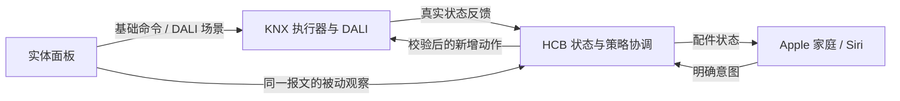

# 墙面面板、DALI 与 HomeKit 的统一操作设计

2026-09-14。根据用户提供的七张面板标签、`801-2.knxproj` 的设备/通信对象/参数覆盖值及本分支代码重新设计。

**状态：这是下一阶段的交互与 ETS 迁移规格，不是已经下载到家中的配置。** 当前六个互斥 `HouseMode` 是第一版软件实现；这里的分层模型取代它作为最终设计方向。此次已落地的代码仅补全已确认的面板相对调光/调色和全关报文的被动识别，不改变现有按键动作，不新增实控界面。

## 1. 现在真正的问题

现有面板并不是完全没有接入 HCB：灯状态能反馈到实体，软件会接收部分场景和自动化 Toggle。但这些连接尚未形成一致的用户操作和状态语义。

| 已核实的现象 | 后果 |
| --- | --- |
| 大部分面板左列短按是“恒照/自适应”，长按才是灯光调节；这些使用 `1-button dimming`，两个动作分别关联软件开关与 DALI 调节对象 | 进屋找开关灯时，最顺手的位置在修改自动化策略；长按方向还会交替变化 |
| 入户“回家”向 `0/0/2` 发值 7，即 ETS 场景 8；“离家”向 `0/0/1` 发 OFF | 前者是场景调用，后者是即时照明全关；两者都没有独立、持久的家庭在家/离家状态 |
| 过道“夜间”是 `0/0/11` 的全屋软件按钮；卧室“夜间”是本房间 Toggle；客厅还有一个 DALI 夜间场景 | 同一个词分别表示全屋动作、策略开关和灯光画面 |
| 面板长按使用 10 个 DPT 3.007 相对调光/调色地址，之前 HCB 只覆盖了绝对值等命令 | 墙上调过灯后，软件仍可能改变它；本次补上这些输入的手动保护 |
| 入户“客厅整体”调节实际还关联厨房、玄关和餐厅灯；过道“部分”调节范围更小 | 仅从组地址名称推断房间范围会漏掉被操作的设备 |
| 北卧床头 C2 有“主要”场景的参数覆盖值，但没有对应通信对象链接；标签写“功能” | 有参数和标签不等于有可执行的总线功能；目前应视为未接通的候选按键 |
| 若干场景指示灯直接监听全屋共享的 `0/0/2`，以报文值比较点亮 | 表示收到过某个场景号，不证明灯光仍处于该场景；其他房间场景还可能影响显示 |
| 客厅恒照相关地址连接客厅传感器逻辑和“厨房传感器”的恒照对象 | 客厅还有硬件自动控制路径。Java 的暂停标志不能独自约束这个路径；传感器用途不一定等于设备描述，需在 ETS 逐对象确认 |

七块面板的 ETS 参数均选择四联 arina，有 A1/A2 至 D1/D2 八个触点；过道、入户、北卧入口和卫生间明确覆盖选型为 `UP 203/x3` 类别。其他面板未显式覆盖同一选型参数，不能把通用应用的默认值当作实物型号证明。厂商手册支持成对调光、遮阳、单键场景和状态灯，但内置八通道场景控制模块仅适用于 x4/x5，必须逐块核对，不能假定全部面板能执行任意多条联动。第二报文也受主功能限制，“长按”可能是替代动作或延时附加动作，不能只看 `Send additional telegram = Yes` 就判断。[Siemens 910301 应用手册，页 1–7、44–45](https://cache.industry.siemens.com/dl/files/613/98163613/att_1023532/v1/040_UP20x910301_apb_en_arina_sensor_202005.pdf)。

## 2. 三个入口，各自负责什么

**墙面面板是主要日常界面。** 高频的开关、调光、常用房间场景和窗帘停止保留 KNX 直达执行器。关掉 HCB 后，这些已正确配置的功能仍可工作。家人和访客不需要先理解恒照度、自适应、传感器门控。

**Apple 家庭是手机和 Siri 入口。** 按真实房间放灯、窗帘及少量房间场景；首页保留回家、离家、晚安等入口。恒照度、自适应、策略恢复等低频控制放在房间下或单独的“家庭控制”房间，不铺满首页。房间、区域、收藏和场景由 Apple 家庭端组织，桥接代码不能直接替用户创建整套 Home 布局。[Apple：按房间与区域组织配件](https://support.apple.com/en-asia/126180)。

**HCB 负责统一意图、协调自动化和诊断。** 它理解“北卧在睡觉”“客厅刚手动调暗”，避免争抢控制权。维护界面应解释“自动化为何暂停、到几点、由谁设置、哪些状态未知”。这些详细文字不应假装可以塞进 Apple 家庭原生的普通开关卡片；先保留本地诊断，后续如需要再做只读维护页。

面板发出的原生场景已经由 DALI 执行，HCB 只接纳这次选择并让自动化让路，不能再回放一遍场景。只有手机请求或确实只面向 HCB 的按钮意图，才由软件发出相应控制命令。

## 3. 模式应分层，避免互相排斥

| 层次 | 状态或动作 | 作用范围 |
| --- | --- | --- |
| 家庭在家状态 | 在家 / 离家 | 离家抑制自动开灯，但不锁死手动按键；无地理围栏推断 |
| 房间使用状态 | 自动、日常、放松、观影、睡眠、阅读/工作、洗浴 | 同一房间互斥，不同房间可以并存；各房间只提供相关项目 |
| 临时活动 | 访客、公共区清扫、指定房间清扫 | 有范围、起止条件和恢复规则；清扫默认公共区，卧室需明确加入 |
| 手动调整 | 开关、亮度、色温 | 只压住会覆盖这次操作的策略；新的手动选择替换旧的恢复任务 |
| 快捷动作 | 回家、离家、全屋晚安、晨起 | 修改上面的状态并发出一次动作，不增加另一套独立状态机 |

因此，“客厅观影 + 北卧睡眠 + 南卧阅读”可以同时成立；“全屋晚安”是一次批量选择，不应阻止后来只把南卧切回阅读。访客状态也不应因为客厅选了观影就自动丢失。

优先级：设备本身的限制 → 最新明确手动动作 → 明确房间场景/临时活动 → 在家状态对自动化的许可 → 默认自动策略。离家只禁止自主开灯；人在屋里手动开灯仍执行，并显式提醒家庭状态仍是离家。重新回家不回放离家前的灯光快照。

建议的具体行为：

- **回家：** 设置在家，恢复允许的默认自动化；玄关根据已知照度选择欢迎灯，未知照度时只执行明确选定的固定欢迎场景。卧室保持原状。
- **离家：** 明确选择后，全屋照明关，所有会自主开灯的硬件和软件策略进入抑制。窗帘、烤箱、电视不附带操作。“照明全关”仍是独立动作，不能当成离家证据。
- **全屋晚安：** 公共区进入安静/低亮路径，两个卧室分别进入睡眠默认；不据此推断无人，不操作窗帘。任何卧室可单独恢复阅读。
- **房间睡眠：** 先按现场确认的场景关闭主光、保留低位灯策略；屏蔽主灯恒照和不合适的自动场景。起夜只响应本房间/必要通道，亮度需现场确认最低稳定值。
- **观影：** 仅锁定客厅灯光意图和相关恒照/调色门控；退出回日常或自动，不恢复进入前亮着的每一盏灯。
- **洗浴：** 显式选择后保障照明，短暂的“无人”不能全黑。超时首先退出洗浴偏好，只有确认无人并满足保持时间才允许自动关灯；传感器未知时维持安全的现状。建议初始 45 分钟提示、两小时复核，而非到点强制熄灯。
- **清扫：** 默认公共区，初始可试 90%/4000 K，暂停被覆盖区域的照明策略；90 分钟自动结束活动状态但不突然关灯。仍在睡眠的卧室不默认加入。
- **访客：** 公共区保持手动或明确场景，减少自动熄灯；卧室不动。显式结束或当天设定期限后恢复允许的策略，不播放旧灯光。

这些时间、亮度是待试用的建议值，不是已从传感器或 DALI 插件读出的当前配置。

## 4. 七块面板的具体布局建议

每块仍按 **A、B、C、D 四列，上 1 下 2**。A 列保持容易找到的本区域开/关与长按调亮/调暗，避免全关只能长按。复杂设备控制从长按灯光键中移走。`自动` 表示恢复该房间允许的默认策略，不表示无条件打开灯，也不覆盖全屋离家。

PDF 01 对应过道、03 对应入户、07 对应卫生间的功能组合非常明确；02 推断为北卧床头、06 为南卧床头。04/05 标签完全一致，仅凭标签无法决定哪个是南卧，以下按 ETS 的房间名设计，两块现场贴标前核对位置。所有编号映射均未用现场逐键测试确认。

| 面板 | A1 / A2 | B1 / B2 | C1 / C2 | D1 / D2 |
| --- | --- | --- | --- | --- |
| 入户（03） | 公共区开 / 公共区关；长按亮/暗 | 客厅日常 / 客厅放松 | 客厅窗帘 / 客厅窗纱 | 回家 / 离家 |
| 过道（01） | 客厅开 / 客厅关；长按亮/暗 | 厨房照明 / 客厅自动 | 客厅日常 / 客厅观影 | 公共区夜灯 / 公共区关灯；D1 长按全屋晚安 |
| 北卧入口（04 或 05） | 本房开 / 本房关；长按亮/暗 | 窗帘 / 停止 | 日常 / 放松 | 阅读 / 自动 |
| 南卧入口（05 或 04） | 本房开 / 本房关；长按亮/暗 | 窗帘 / 停止 | 日常 / 放松 | 阅读 / 自动 |
| 北卧床头（02） | 床头开 / 床头关；长按床头亮/暗 | 窗帘 / 停止 | 阅读 / 自动 | 起夜灯 / 本房关灯并睡眠；D2 长按全屋晚安 |
| 南卧床头（06） | 床头开 / 床头关；长按床头亮/暗 | 窗帘 / 停止 | 阅读 / 自动 | 起夜灯 / 本房关灯并睡眠；D2 长按全屋晚安 |
| 卫生间（07） | 主照明开 / 本房关；长按亮/暗 | 洁面 / 洗浴 | 镜灯 / 淋浴灯 | 夜灯 / 自动 |

**实现约束：** A 列成对调光的两个短按作用于相同灯组；床头只控制床头照明，D2 短按提供明确的本房关灯并进入睡眠。不能把“A1 床头开、A2 全房关”强行塞进同一个开关对象，也不能为了版面绑定会影响全屋的组地址。逐项 ETS 模板必须确定每组参与灯具后才可出最终标签。

窗帘保留当前“运行/独立停止”的两键方式作为迁移起点，先修正已发现的停止地址问题。入户只有两键供窗帘和纱帘使用，建议改为厂商原生单键遮阳控制：短按停止、长按运行/方向交替，标签明确“短停 · 长开合”；如果家人更习惯明确开/关，改用成对控制并把纱帘移至手机。这是可选择的布局取舍，不是让软件猜方向。所有电机的方向、停止值和运动反馈必须实测。

全屋晚安长按建议 2 秒；普通调光按厂商支持值先试 0.5 秒。同一功能类型的计时可能是设备级共用参数，不能假设每键都能独立设定。离家使用明确标注的专用键；可配置短按仅公共区关、长按真正离家，避免来客误关卧室，最终标签必须把两者都写出。禁止场景保存/学习作为普通长按功能。

北卧床头原“功能”及南卧床头“电视”不再占据照明核心位置；电视和扫地机先放 Apple 家庭。若床头电视确实高频，南卧 C1/C2 可选“电视/播放暂停”，阅读改到入口或手机，但两卧照明 A/B/D 列保持一致。

## 5. Apple 家庭应该如何呈现

**首页场景：** 回家、离家、全屋晚安、晨起、公共区清扫、访客。不要在首页同时铺出几十个灯、十二个策略开关和每个 ETS 场景号。

**每个房间：** 主要灯光与窗帘在前；客厅提供日常/放松/观影，卧室提供日常/阅读/放松/睡眠，浴室提供洁面/洗浴/夜灯；自动恢复放在同一房间。卧室灯具不因为选“公共区”被一并控制。

**桥接契约：**

| 对象 | 建议 HomeKit 表达 | 语义 |
| --- | --- | --- |
| 灯具、窗帘、占用/照度 | 现有标准配件 | 实际值来自设备反馈，离线/未知显示不可用 |
| 家庭离家状态 | 持续型开关“离家状态” | ON 离家、OFF 回家；回家/离家 Home 场景各只设置这一控制器入口，不再分别写几十盏灯 |
| 房间持续场景 | 房间内互斥的少量虚拟开关 | ON 选择该房间意图；选择另一个房间不影响它；手动改变关键灯光后标为手动/解除场景匹配 |
| 晚安、晨起、恢复自动等一次动作 | 明确的瞬时命令开关，再由 Home 场景包装 | 每次 ON 执行一次并复位；不声称动作一直处于“开启” |
| 原恒照/自适应 Toggle | 保留身份和旧名称兼容入口，移出收藏 | 渐进迁移，避免旧 Home 自动化突然失效 |
| 详细暂停原因和执行阶段 | 本地诊断 | 原生 Home 开关不能完整呈现任意文字、进度和错误详情 |

Apple 家庭可由用户建立场景并指定配件目标值；HAP 桥接配件不等于已经替用户建立了 Home 场景。瞬时开关复位后的场景“已激活”外观以及重复执行、Siri 名称需要真机验收，不承诺 Apple 家庭把它显示成原生按钮。需要持久“当前场景”时，用房间意图状态表达，不能让一瞬间收到的 DALI 场景号永远点亮一个开关。[Apple：创建与使用场景](https://support.apple.com/guide/iphone/create-and-use-scenes-iphb96e3f655/ios)。

当前分支仍是六个全屋模式开关，没有房间场景配件，也没有自动建立 Home 场景或改动现有 Apple 家庭。上述为下一版的配件设计；迁移应保留旧六开关作为兼容入口，映射到新意图，逐一替换用户现有自动化后再考虑隐藏。

## 6. ETS 中需要怎样整理

1. **先确定每项控制的负责人。** 列出每房间“开关、占用开灯、恒照、色温、夜间”由谁决定。客厅保留传感器内的本地恒照作为优先候选，卧室/浴室现有 HCB 策略逐项核对；任何迁移目标同一输出同一时刻只有一个策略负责。不能仅凭设备名称或 Python 目录决定关闭哪个逻辑。
2. **保留现有基础通信，新增明确语义。** 命令、状态、使能、阻止自动、有效状态、场景请求分开命名。旧 `0/0/2` 继续承载原生 DALI scene recall，保留原号；新语义地址用 `house.presence.request/status`、`room.profile.request/status`、`room.auto.inhibit/effective` 等符号先审阅，分配实际空闲 GA 后再加配置。不覆盖一个已用 GA 的 DPT 或方向。
3. **硬件自动化也必须让路。** 观影/睡眠/手动调光的抑制必须传到真正控制该区域的传感器门控，不能只改 Java。先验证门控极性、是否会立即发 ON/OFF、恢复后行为和掉电默认值。纯面板直控也要能触发本地手动优先，HCB 离线时仍有确定行为；若现有硬件无法表达，明确降级范围，不编造本地定时/逻辑能力。
4. **DALI 管灯光画面，HCB 管跨设备意图。** 给常用场景整理亮度、色温、渐变时间、参与/不参与的组。保持房间隔离；“晚安”不能通过错误的全局场景意外点亮其他卧室。不凭 XML 命名假定实际保存值。网关支持场景配置和测试，需在 ETS 插件中导出/核对场景表。[Siemens N 141/21 应用手册，场景配置章节](https://knx-td.sihub.siemens.com/en/apb/983411_983711_983D11_KNX-DALI-Gateway_APB_en_RS-AF.pdf)。
5. **状态灯绑定真实含义。** 开关灯键读对应执行器状态；自动键指示实际有效，不能只显示“用户曾开启”；场景灯用房间意图并在手动改变后清除。全屋共享场景号只作为事件。状态值由一个明确权威源回答，其他面板以接收为主；R/T/W/U 标志逐对象核对，不批量套模板。
6. **离线指示不要假造。** 现有面板状态对象不自动等价于带超时健康检测。HCB 停止后若面板保留旧 LED 值，不能宣称它能自行显示控制器离线；需另核对可用硬件的周期监测能力，或让 LED 只表示本地已确认状态。

## 7. 迁移步骤与可验收结果

| 步骤 | 产物 / 验收 |
| --- | --- |
| 已完成：理解原标签和 XML | 七面板映射、关键按键/场景值、原生硬件路径、输入缺口；详细参数覆盖值留在私有附录 |
| 已完成：最小软件修复 | 被动接收十个相对调节地址及全关；正确房间暂停；不重发，不改 ETS，不推断离家 |
| 下一步：每键施工表 | 短/长/释放、发送 GA/DPT/值、接收对象、状态灯地址、负责人、离线行为；确认后才能打印替换标签 |
| 下一步：ETS 副本试点 | 先一块卧室入口面板与对应灯组；备份应用和 DALI 场景参数，只下载明确受影响设备，不做全网下载 |
| 下一步：软件状态迁移 | 家庭在家状态 + 房间场景 + 活动覆盖；面板原生命令接纳路径与手机执行路径分开；兼容六个旧模式 ID |
| 下一步：Home 真机 | 旧配对保留、各配件房间、场景重复执行、命名/Siri、离线显示和跨端回显 |
| 下一步：停机演练 | 停 HCB 后仍可短按开关、长按调光、窗帘停；软件专有功能的降级符合说明，恢复后不重放旧动作 |

关键场景：一人在北卧睡觉、另一人在客厅观影；床头手动调暖后自动化不夺回；洗澡短暂丢占用不熄灯；访客找到短按关灯；离家后传感器不重新点灯；另一房间场景不清除本房间状态；重启后保留明确意图而不回放灯光。

## 8. 本次代码修复的准确边界

`KNXPanelInputs` 显式声明相对调光/调色地址，作为 `EVENT` 进入 ETS 契约，没有增加这些地址的读写许可。入户整体调节保护客厅、厨房和玄关；其他地址按实际房间作用。DPT 3 的两个 stop 值 0/8、读响应、软件回显和不合法 payload 不新建/延长手动覆盖。`0/0/1 = OFF` 为当前灯具目录的各房间建立默认 30 分钟软件手动暂停；这仍然只是“手动全关”，并非持久离家模式。

此修复只约束 HCB 自己的策略。硬件传感器仍按当前 ETS 逻辑运行；本地门控、面板新布局、分层状态、房间场景配件、LED 重绑和新 Home 场景均未上线。45 秒任意报文存活判断保持不变。
