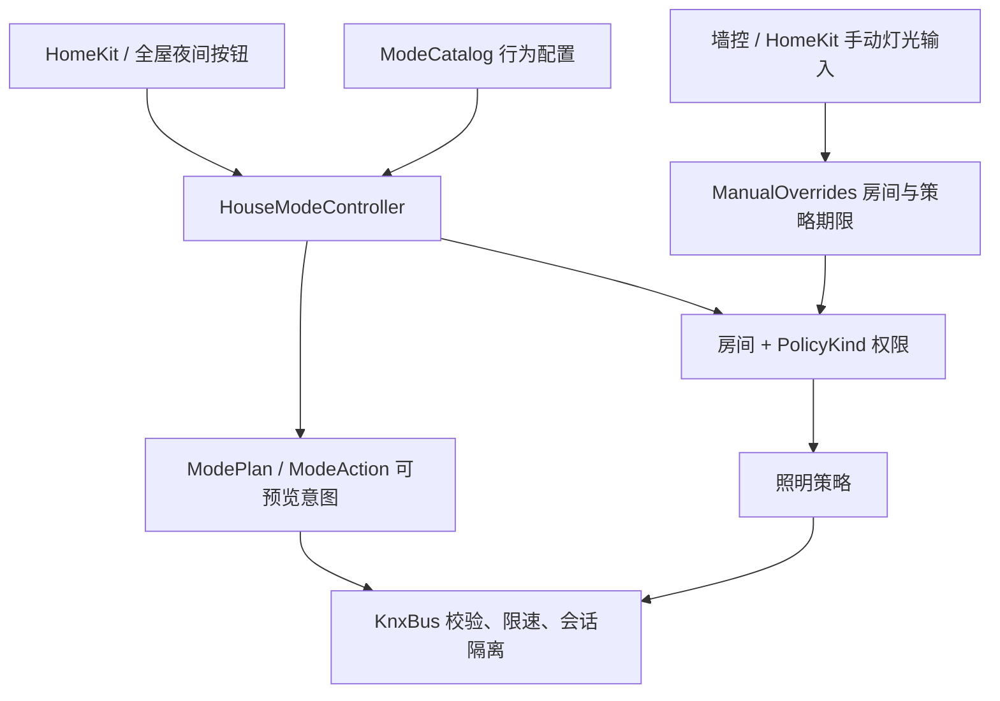

# 家庭模式与手动优先

模式层把“今天如何使用这个家”与灯具地址、连接重试和各个照明策略分开。当前提供六个互斥的家庭模式，并允许房间级手动覆盖叠加其上。动作使用现有灯具、自动化开关和 ETS 场景，不要求重新下载 ETS。

这些是根据原有设备和场景设计的初始行为，尚未在真实房间中执行。模式配置集中在 `ModeCatalog`，实际使用后的调整可以单独审阅。

## 模式行为

| 模式 | 照明动作 | 自动化优先级 |
| --- | --- | --- |
| 日常 `HOME` | 不回放之前的灯光状态 | 恢复本进程中由模式接管、且未被手动改过的自动化设置；仍尊重未到期的手动覆盖 |
| 离家 `AWAY` | 关闭目录中全部灯具 | 暂停照明策略，防止占用报文再次点灯；手动开灯仍可用 |
| 睡眠 `SLEEP` | 客厅调用已有夜间场景；关闭玄关、走廊、厨房已配置灯具 | 开启已有夜间照明 Toggle，关闭普通/恒照度/自适应 Toggle；只允许夜间照明策略运行，卧室和浴室继续按占用及既有夜间规则响应 |
| 观影 `MOVIE` | 客厅调用已有观影场景（ETS 场景 5，报文值 4） | 只接管客厅，暂停该房间自动调光/调色和夜间策略；其他房间照常 |
| 清扫 `CLEANING` | 所有灯具打开；可调光灯设 90%，可调色温灯设 4000 K | 暂停照明策略，避免清扫时占用或照度反馈把灯改回去 |
| 访客 `GUEST` | 客厅调用已有 HOME 场景 | 公共区域让出自动控制，保留卧室策略；公共区域以墙控和 HomeKit 手动操作为主 |

离家、睡眠和观影不会自动操作窗帘、电视、扫地机、烤箱或其他未纳入上述动作的设备。当前窗帘停止对象仍需现场核对，HA 里已有的电视也不应被随意当成客厅电视。模式没有地理围栏或“全屋无人即离家”的推断。

睡眠模式沿用原夜间策略的 5 点锁定、9 点关闭夜间 Toggle 规则；家庭模式本身仍需显式切回日常。并非所有公共区域都有夜间感应策略，模式不会凭空添加不存在的传感器或夜灯线路。

## 如何使用

在通过观察阶段后，使用 `--mode live --enable-automations`。HomeKit 会多出日常、离家、睡眠、观影、清扫、访客六个虚拟开关，原有配件 ID 不变：

- 打开某模式，选择该模式。重复打开同一已生效模式不会重新播放场景。
- 关闭当前模式，回到日常；关闭非当前模式没有动作。日常开关本身不能被关成“没有模式”。
- 原走廊全屋夜间按钮 `0/0/11` 复用同一个协调器，切换睡眠/日常，不再维护另一套独立的夜间切换逻辑。
- 如果模式中途失败或进程重启后处于暂停，日常开关仍可用于恢复；其他模式可能显示不可用。恢复连接、查看诊断后再显式选择需要的模式。

HomeKit 写操作确认的是“请求已接受”，大批量照明动作会限速执行。开关代表控制器选择的模式，不代表每盏灯已完成动作。`health.json` 的 `houseMode.phase` 区分 `APPLYING`、`ACTIVE`、`PAUSED`、`FAILED`；真实灯光状态仍看各设备反馈。这样不会为了等待全屋清扫照明逐个发送而长时间阻塞 HomeKit 请求。

先在电脑上查看某模式的具体意图，完全不连接设备：

```sh
build/install/bunniesHCB/bin/bunniesHCB --explain-mode movie
build/install/bunniesHCB/bin/bunniesHCB --explain-mode cleaning
```

输出列出自动化设置、灯具动作和场景编号。离线时状态未知，因此会说明哪些原设置无法预先确认；日常模式的恢复清单依赖真实运行中的接管记录，离线预览不会伪造这些记录。

## 手动操作如何让自动化让路

默认手动覆盖时间为 30 分钟，可用 `--manual-hold-minutes 45` 修改，范围 1–1440 分钟。

| 手动操作 | 暂停范围 | 继续保留 |
| --- | --- | --- |
| 开关灯、绝对亮度 | 该房间的占用、恒照度、夜间照明策略 | 其他房间，以及该房间自适应色温 |
| 调色温 | 该房间的自适应色温，以及可能携带色温的占用/夜间场景策略 | 恒照度调光和其他房间 |
| 再次手动操作 | 延长对应覆盖期限 | 不产生设备写入或自动回放 |
| 显式打开某自动化 Toggle | 立即解除该策略的手动暂停 | 家庭模式仍有优先级，例如离家不会因此自行恢复占用开灯 |
| 选择另一个家庭模式 | 新模式接管的房间以新选择为准 | 未涉及房间的手动覆盖继续有效；切回日常也保留未到期覆盖 |

识别来源包括 HomeKit 的灯具 setter，以及 KNX 契约中已声明的灯具/策略组写地址。执行器状态反馈、读响应和本会话的写回显不会被当成手动输入。其他客户端写入同一命令地址也视作外部控制请求并获得优先级，不能仅凭 telegram 判断它是否由人发起；这也是不应同时运行两个 live 控制器的原因。尚未声明的相对调光对象不通过相邻地址猜测识别，应在确认 ETS 对象后显式纳入配置。

手动覆盖只暂停相关策略，不阻止墙面按钮、HomeKit 命令和真实设备反馈。覆盖期限到达后恢复策略；自适应色温会重新计算当前目标，避免因为旧的去重缓存而永远不恢复。

新的家庭模式会使旧的场景恢复和延时关灯任务失效。房间在设置延时关灯之后又收到手动灯光操作，也会取消该次延时动作。已经发到总线上的命令无法撤回；此规则保护后续动作，不承诺消除毫秒级并发时已经在途的物理操作。

## 接管、恢复和失败

每个自动化 Toggle 的接管记录包含：进入前的已知值、模式请求值、连接代次、手动修改版本。退出模式时只有这些条件仍匹配，才恢复进入前的值。即使手动再次写入同一个 OFF，也会增加修改版本，所以退出观影或离家不会擅自把它打开。切换清扫到观影时，卧室被接管的设置可以恢复，客厅继续由观影接管。

未知初始值不转换成默认 ON/OFF。模式可以根据用户的明确选择写入新的值，但不会编造“之前是什么”并在离开时恢复。灯具电源、亮度和色温不做快照回放，防止退出模式时突然打开以前亮着的灯。

KNX 的多条组写不具备事务性。协调器先校验计划，再限速执行；中途失败保留已经执行的动作，暂停策略，报告 `FAILED`，等待显式恢复。不自动尝试相反场景“回滚”，也不把剩余动作排进断线重试队列。排队的模式请求绑定连接代次，连接关闭立即失败；请求上限 8 个、执行请求期限 30 秒。

`house-mode.json` 只持久化模式意图和阶段，不持久化硬件命令。非日常模式下重启进程，会加载为 `PAUSED`，不自动重放场景、清扫或关灯动作。旧进程的接管快照与房间手动覆盖尚未持久化，因此重启后回到日常不会恢复旧进程的 Toggle 快照；需要检查自动化开关的实际值。正常连接重建不会把这些模式动作重新执行一遍。

## 代码职责与扩展



`ModeCatalog` 定义生活行为，`HouseModeController` 管理切换/所有权/失败，`ManualOverrides` 处理手动期限，`ManagedLightingPolicy` 统一检查房间和策略类型。新增模式应修改行为目录并增加场景级回归测试；新增物理设备先补实体与 ETS 契约，不在模式代码里直接操作 communicator。

已用假传输验证全部模式、跨模式恢复、重复 OFF、未知状态、部分写失败、断线时排队取消、启动不回放、HomeKit 异步接受、房间级暂停/到期和旧定时任务失效。上线仍需按 [现场验收](operations.md) 检查真实场景亮度、色温、占用行为及家庭成员的使用体验。
