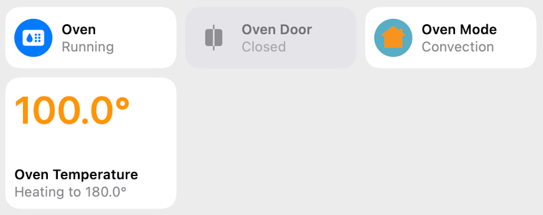
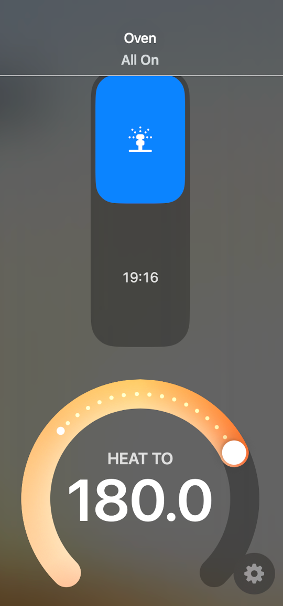

### BSH Broadlink Oven Adapter
This is a custom integration enabling direct local control over IP network on my own Siemens CS289ABS6W steam oven which uses a Broadlink Wi-Fi module internally (device type `0x6579`) for communicating with the vendor cloud.

Similar BSH ovens using Broadlink modules likely share the same  protocol with different command mappings.

To use this adapter, you might have to connect the oven to your local network through the vendor-provided method (HomeConnect). Using a firewall for blocking Internet access is recommended after the initial setup.

#### Features
- Clock sync
- State management
- Bridged to HomeKit
    - Duration selection (Valve type)
    - Mode selection (Television and Input Sources types)
    - Temperature control (Heater type)
    - Door open/close status (Contact Sensor type)

#### Screenshots



#### Example

```java
import es.buni.hcb.adapters.broadlink.BroadlinkAdapter;
import es.buni.hcb.adapters.broadlink.oven.BSHOven;
import es.buni.hcb.adapters.broadlink.oven.OvenCommandBuilder;
import es.buni.hcb.adapters.broadlink.oven.OvenMode;

BroadlinkAdapter adapter = new BroadlinkAdapter(entityRegistry);
BSHOven oven = new BSHOven(
        adapter,
        location, // "kitchen"
        id, // "oven"
        host, // oven ip address
        macAddress // oven MAC address
);

adapter.start(); // initializes
oven.ready(); // wakes the oven
oven.sendCommand(
        OvenCommandBuilder
                .create()
                .setMode(OvenMode.CONVECTION_GRILL)
                .setSteamAssist(true)
                .setTemperature(230)
                .setDuration(60 * 30)
);
```

#### Credits
Inspired by [python-broadlink](https://github.com/mjg59/python-broadlink).